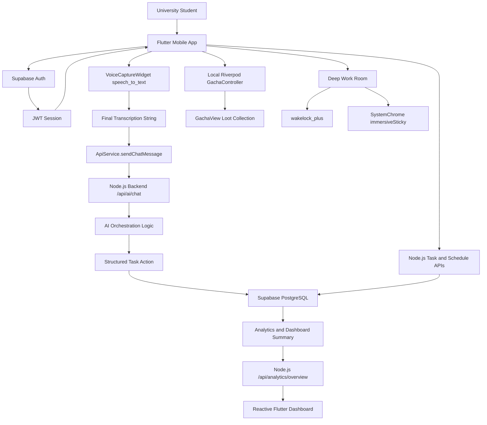
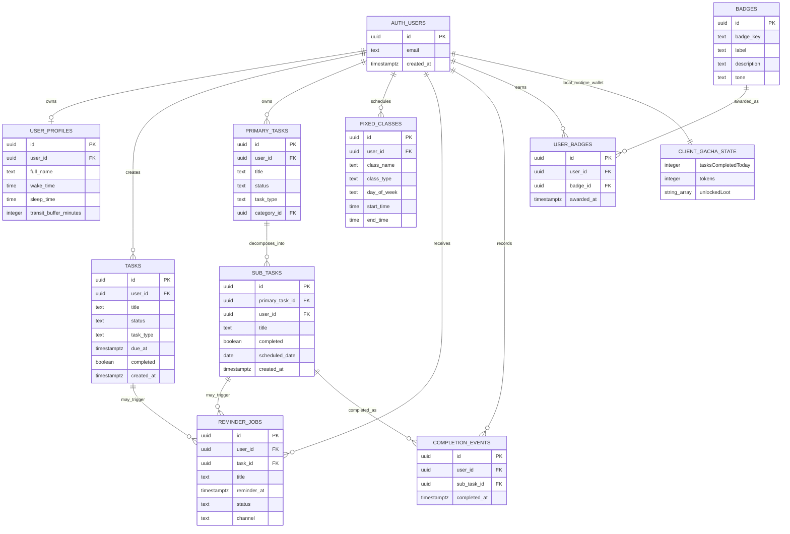

# Rakan Student: System Architecture and Engineering Report

## 1. Executive Summary and System Objectives

Rakan Student is a mobile-first academic productivity system designed for university students who must continuously translate lectures, reminders, deadlines, class schedules, and personal study plans into actionable work. The project addresses a common student-productivity failure mode: information is captured across fragmented surfaces, but the student still bears the cognitive cost of converting it into structured tasks, prioritizing it, and sustaining motivation long enough to complete it.

The system combines four engineering ideas into a single student-facing product:

1. **AI-assisted task capture**: natural speech is converted into task intent through a Flutter speech-recognition interface and a Node.js AI orchestration backend.
2. **Reactive academic planning**: the dashboard, task list, and calendar refresh through shared mutation signals so that task and schedule changes are reflected immediately.
3. **Gamified reinforcement**: local Gacha tokens and loot provide a lightweight dopamine loop for repeated task completion.
4. **Deep-focus support**: a full-screen focus room uses operating-system integrations to reduce visual distractions and keep the device awake during study sessions.

The resulting application is not merely a task list. It is an academic orchestration layer: it accepts unstructured student intent, transforms it into structured records, surfaces immediate context through Bento-style dashboard cards, and reinforces completion through a reward loop. This makes Rakan Student particularly suitable as a Final Year Project because it demonstrates applied software engineering across mobile UI, backend API design, state management, database modelling, test automation, and human-centered interaction design.

### Primary System Objectives

- **Reduce capture friction** by allowing students to create tasks from voice instead of manual form entry.
- **Improve situational awareness** through a dashboard that reflects pending tasks, active reminders, and the next class.
- **Prevent state desynchronization** by using explicit mutation notifiers and reactive state providers.
- **Increase user motivation** through a local token economy and randomized Gacha loot collection.
- **Support sustained concentration** with an immersive Deep Work Room using WakeLock and system UI controls.
- **Maintain engineering reliability** through widget tests, DTO tests, bounded asynchronous pumping, and dependency injection for testable UI.

### Architectural Thesis

Rakan Student adopts a hybrid architecture: Supabase provides authentication and PostgreSQL-backed persistence, a Node.js backend owns protected orchestration workflows, and the Flutter client manages real-time interaction state. This hybrid design is appropriate because not all state deserves the same persistence strategy. Academic records such as tasks, reminders, profiles, and classes are persisted in Supabase. Reward-loop state, by contrast, is intentionally local in the current feature-freeze release to keep the Gacha system fast, private, and decoupled from backend availability.

## 2. High-Level System Architecture

At a high level, Rakan Student is organized into three principal layers:

- **Presentation and local interaction layer**: Flutter mobile application.
- **Application service and orchestration layer**: Node.js Express backend.
- **Persistence and identity layer**: Supabase Auth and Supabase PostgreSQL.

The Flutter application is responsible for rendering the student experience, capturing voice input, controlling native focus-mode hardware behaviors, and maintaining local reward state. The Node.js backend is responsible for authenticated API workflows, AI chat/action routing, analytics aggregation, settings persistence, calendar/schedule routes, and Supabase data access. Supabase is the system of record for user-owned academic data and also provides authentication primitives.



### Runtime Data Flow

1. The user authenticates through Supabase and receives a session token.
2. Flutter stores/uses the authenticated session and sends bearer-authenticated requests to the backend.
3. A voice-to-task request begins locally in `VoiceCaptureWidget`, which captures speech through `speech_to_text`.
4. The finalized transcript is passed to `ApiService.sendChatMessage()`.
5. `ApiService` posts the payload to the backend AI route at `$baseUrl/ai/chat`; because the configured `baseUrl` includes `/api`, this resolves to the backend route `/api/ai/chat`.
6. The Node.js backend interprets the message and performs a task action when the AI response contains a supported action.
7. Supabase PostgreSQL persists durable records such as tasks, reminders, classes, profiles, and analytics data.
8. Flutter refreshes visible state using direct reloads and mutation notifiers such as `ApiService.taskMutationNotifier` and `ApiService.scheduleMutationNotifier`.
9. Gacha state remains local in Riverpod, allowing task completion to immediately increment progress toward token rewards.

### Architectural Boundaries

| Boundary | Responsibility | Rationale |
| --- | --- | --- |
| Flutter UI | Interaction, rendering, voice capture, local rewards, native focus mode | Keeps the student experience responsive and device-aware. |
| ApiService | Client API abstraction and mutation notifications | Centralizes backend communication and global refresh signals. |
| Node.js backend | Protected orchestration, analytics, settings, tasks, schedules | Prevents the mobile app from owning privileged business logic. |
| Supabase | Auth, Postgres persistence, RLS-protected data | Provides durable identity and database security. |
| Riverpod GachaController | Local token and loot economy | Keeps gamification private and independent from backend failures. |

## 3. Database Architecture and ERD

The backend database is Supabase PostgreSQL. The actual schema contains a broad set of tables for users, profiles, tasks, schedules, orchestration, analytics, notifications, badges, and workspace collaboration. For FYP evaluation, the following ERD focuses on the entities most relevant to the feature-freeze mobile application: users, tasks, classes, reminders, and reward-related achievement data.

It is important to distinguish between two reward categories:

- **Database-backed achievements**: tables such as `badges` and `user_badges` exist in Supabase and model durable achievement records.
- **Local Gacha economy**: token count, task-completion streak toward the next token, and unlocked loot are held in local Riverpod state in the mobile app. This is deliberately not persisted to Supabase in the current release.



### Database Design Notes

- `user_profiles` stores profile-level settings and the current full name used by profile and dashboard surfaces.
- `tasks`, `primary_tasks`, and `sub_tasks` support both simple custom tasks and orchestrated/decomposed task structures.
- `fixed_classes` stores weekly schedule entries with day/time constraints.
- `reminder_jobs` supports scheduled reminders and analytics surfaces.
- `completion_events`, `badges`, and `user_badges` provide durable engagement and achievement records.
- The Gacha wallet is represented in the ERD as `CLIENT_GACHA_STATE` to document its relationship to users while making clear that it is local runtime state, not a Supabase table in the current mobile feature freeze.

## 4. Core Module Implementation Deep-Dives

### 4.1 AI Voice-to-Task Pipeline

The voice-to-task module reduces friction in task creation by converting spoken student intent into a structured backend action. Its implementation spans the mobile UI, the API service abstraction, and the Node.js AI backend.

#### Mobile Capture Layer

The mobile capture layer is implemented in `lib/features/tasks/voice_capture_widget.dart`. The widget initializes the `SpeechToText` engine, controls listening state, and renders a microphone interaction surface. While recording, the widget displays the live transcription in the UI, allowing the student to verify that speech recognition is working.

Key implementation characteristics:

- Uses `speech_to_text` for native speech recognition.
- Maintains recording and transcription state inside the widget.
- Shows a visible listening state with animated microphone feedback.
- Captures the final transcription when listening stops.
- Handles empty transcripts defensively to avoid sending meaningless backend requests.

#### API Transmission Layer

When a final transcript exists, the voice widget calls:

```dart
final response = await _apiService.sendChatMessage(finalText);
```

The API service constructs a JSON request and posts it to:

```text
$baseUrl/ai/chat
```

Because the configured mobile API base URL includes `/api`, the effective backend route is:

```text
POST /api/ai/chat
```

The conceptual payload is:

```json
{
  "message": "remind me to submit software quality homework tonight"
}
```

The backend AI route interprets the natural language request and can return an action-oriented response. On the Flutter side, this is represented by `AiChatResponse`, which contains:

- `message`: user-facing backend response.
- `actionPerformed`: whether the backend executed an action.
- `actionType`: optional action classification.

#### Task List Refresh

After the AI response is received, `TasksView` calls `_handleVoiceTaskCreated()`, which refreshes tasks and displays the response message. This ensures that the newly created task appears immediately rather than waiting for the user to manually refresh or navigate away.

The pipeline therefore has the following sequence:

1. User speaks.
2. Flutter transcribes speech.
3. Flutter sends transcript to backend AI chat route.
4. Backend parses intent and creates a task where appropriate.
5. Flutter reloads the task list.
6. User receives immediate visual confirmation.

### 4.2 Gamified Token Economy

The Gacha system implements a local reward loop intended to reinforce task completion. It is intentionally implemented as client-local state for the feature-freeze release, avoiding backend coupling and preserving responsiveness.

#### State Model

The core reward state is represented by `GachaState`:

- `tasksCompletedToday`: number of completed tasks accumulated toward the next token.
- `tokens`: spendable Gacha pulls.
- `unlockedLoot`: list of loot strings collected by the user.

The state is managed by `GachaController`, a Riverpod `StateNotifier`. This means any widget that watches `gachaControllerProvider` receives updates when the controller assigns a new immutable `GachaState`.

#### Completion-to-Token Flow

The silent mutation bug was addressed by ensuring that task completion updates both external dashboard state and local reward state. When a user marks a task complete in `TasksView`, the flow is:

1. The checkbox or swipe action calls the task completion handler.
2. The UI optimistically updates the visible task state.
3. `ApiService.updateSubTaskCompletion()` persists the completion to the backend.
4. `ApiService.notifyTaskMutation()` increments the global task mutation notifier.
5. If the task transitioned from incomplete to complete, `GachaController.incrementTask()` is invoked.
6. On every third completion, the controller resets `tasksCompletedToday` and increments `tokens`.
7. If a token was earned, the UI displays the `+1 Gacha Token Earned` SnackBar.

This design prevents two categories of state failure:

- **Dashboard desynchronization**: solved through `taskMutationNotifier`.
- **Gacha wallet silence**: solved through Riverpod state reassignment inside `GachaController`.

#### Gacha Pull Flow

The Gacha screen is implemented in `lib/features/gacha/gacha_view.dart`. The pull flow is:

1. User enters `GachaView` from the Profile screen.
2. UI watches `gachaControllerProvider` for token and loot state.
3. If tokens are available, the pull button is enabled.
4. Pulling deducts one token and rolls against a weighted prize pool.
5. The resulting loot is appended to `unlockedLoot`.
6. The UI updates automatically because the provider state changed.

The weighted prize pool gives the feature a recognizable game-system structure:

- Common items: high weight.
- Rare items: medium weight.
- Legendary items: low weight.

This creates a lightweight variable-ratio reward loop, a well-known gamification technique, while remaining simple enough for maintainable student-project code.

### 4.3 Immersive Deep Work Environment

The Deep Work Room transforms focus mode from a normal timer into a dedicated study environment. Its implementation is in `lib/features/focus/focus_view.dart`.

#### Pre-Focus Configuration

When idle, the view presents:

- Standard duration choices: 15, 25, 45, and 60 minutes.
- A custom slider from 5 to 120 minutes.
- An "Enter Deep Work" action.

This gives students both familiar Pomodoro-style presets and enough flexibility for longer study blocks.

#### Hardware and OS Integration

When the user enters a focus session, the app performs two device-level actions:

```dart
await WakelockPlus.enable();
await SystemChrome.setEnabledSystemUIMode(SystemUiMode.immersiveSticky);
```

The engineering rationale is direct:

- `WakelockPlus.enable()` prevents the device from sleeping during active study.
- `SystemUiMode.immersiveSticky` hides system UI affordances to reduce accidental navigation and visual distraction.

When the session ends or the user exits, cleanup is performed:

```dart
await WakelockPlus.disable();
await SystemChrome.setEnabledSystemUIMode(SystemUiMode.edgeToEdge);
```

This cleanup is essential. A focus feature that hides system UI or keeps a device awake must reliably restore the previous hardware state; otherwise, it risks degrading the wider device experience after the user leaves the screen.

#### UX Strategy

The active session uses a dark canvas, a centered countdown, and a subtle breathing animation. The design goal is to remove operational clutter and make the remaining interface legible from a glance. This supports long-running concentration sessions without requiring the student to interact repeatedly with the device.

### 4.4 Reactive Dashboard

The Dashboard is the central coordination surface of the app. It summarizes task load, next class information, reminders, and focus entry points. Its correctness depends on the UI rebuilding when underlying task or schedule data changes.

#### Observer Pattern Through ValueNotifier

The app uses explicit mutation notifiers in `ApiService`:

```dart
static final ValueNotifier<int> taskMutationNotifier = ValueNotifier<int>(0);
static final ValueNotifier<int> scheduleMutationNotifier = ValueNotifier<int>(0);
```

Mutator methods increment the integer value:

```dart
static void notifyTaskMutation() {
  taskMutationNotifier.value++;
}

static void notifyScheduleMutation() {
  scheduleMutationNotifier.value++;
}
```

This is a compact observer pattern. Widgets do not need to know which exact task changed; they only need to know that task-derived summaries are stale. Incrementing the notifier broadcasts that stale state should be refreshed.

#### Dashboard Listeners

The Dashboard registers listeners for task and schedule mutation signals. When the signal changes, the dashboard reloads its summary and schedule-derived data. The Next Class card additionally uses a listenable builder around schedule mutation state so that the visible card repaints when schedule data changes.

#### Preventing UI Desync

Several bugs were resolved through this architecture:

- Tasks added through AI now refresh task lists and dashboard counters.
- Task completion now triggers dashboard mutation notifications.
- Schedule additions trigger the Next Class card to re-evaluate.
- Calendar task lists defensively deduplicate overlapping task sources before rendering.

The core principle is that every write path must have a corresponding invalidation path. Rakan Student applies this principle by pairing database/local mutations with notifier increments or provider state assignments.

## 5. Software Quality Assurance and Testing

Rakan Student currently reports a fully green Flutter test suite:

```text
35/35 widget and DTO tests passing
```

The test suite is significant because it covers not only isolated data transformations but also major UI surfaces and regression-prone reactive behavior.

### Test Categories

| Category | Purpose | Examples |
| --- | --- | --- |
| DTO tests | Validate parsing and state separation | Dashboard summary task/class mapping |
| Widget smoke tests | Ensure screens render primary controls | Auth, Profile, Schedule, Tasks, Calendar |
| Regression tests | Lock previously broken behavior | Next Class reactivity, task deduplication |
| Feature tests | Validate new feature entry points | Gacha view, Deep Work Room setup |
| Async UI tests | Ensure interaction works with animations and navigation | Auth flow, timers, custom task form |

### Reactive Dashboard Test Strategy

The dashboard reactivity test proves that the Next Class container updates when schedule state mutates. This is important because the bug was not a data logic failure; it was a repaint failure. A correct test therefore had to assert UI behavior after state notification, not merely validate a getter.

### Bounded Pumps for Infinite Animations

Some views contain intentionally infinite animations, such as animated voice microphone feedback or decorative authentication backgrounds. In Flutter widget tests, `pumpAndSettle()` can time out when animations never settle. The test suite was repaired by using bounded pumps such as:

```dart
await tester.pump(const Duration(milliseconds: 500));
```

This is a mature testing practice because it acknowledges the presence of valid infinite animations while still advancing the fake clock enough for build and route transitions.

### Off-Screen Interaction Handling

Authentication tests previously failed because buttons were outside the test viewport. The solution was to make tests behave more like a user:

```dart
await tester.ensureVisible(signUpButton);
await tester.tap(signUpButton);
```

This improves test realism and prevents false negatives caused by viewport limitations.

### Supabase and External Dependency Isolation

Tests avoid relying on live Supabase initialization where possible. For example, task view tests can disable initial fetching, voice capture, and cleanup verification through test-only constructor parameters. This isolates UI rendering tests from backend availability and ensures that CI-style verification remains deterministic.

### Current Verification Commands

The standard mobile verification commands are:

```bash
cd rakanstudent_mobile
flutter analyze
flutter test
```

`flutter analyze` confirms static correctness, import validity, and lint compliance. `flutter test` validates the widget and DTO regression suite.

## 6. Technical Challenges and Solutions

### Challenge 1: Silent State Mutation in Task Completion

**Problem.** Marking a task complete updated the local list and backend, but did not notify the dashboard or global reward state. As a result, the Tasks Pending card stayed stale and Gacha tokens did not appear globally.

**Solution.** Completion handlers now call `ApiService.notifyTaskMutation()` after successful persistence and update `GachaController` through Riverpod. This ensures both external dashboard summaries and local reward surfaces are invalidated correctly.

**Engineering lesson.** A successful write is incomplete unless every dependent read model is invalidated.

### Challenge 2: Next Class Card Repaint Gap

**Problem.** The schedule logic correctly computed `nextClassTitle`, but the Dashboard UI did not repaint when schedule data changed.

**Solution.** The Dashboard was wired to listen to schedule mutation state through the appropriate reactive listener. A widget test was added to prove that changing schedule state causes the Next Class text to update.

**Engineering lesson.** Correct domain logic does not guarantee correct UI behavior; reactive bindings must also be tested.

### Challenge 3: Calendar Duplicate Rendering

**Problem.** Tasks appeared multiple times in Calendar because data arrived through overlapping fetch streams.

**Solution.** Calendar state introduced defensive content-based deduplication using normalized task title and calendar date. This protects the UI even if upstream sources overlap.

**Engineering lesson.** UI-facing collections should enforce display-level uniqueness when multiple data sources converge.

### Challenge 4: Flutter FloatingActionButton Hero Tag Collision

**Problem.** Flutter raised a fatal error because multiple `Hero` widgets shared the default FAB hero tag within the same subtree.

**Solution.** FABs were assigned explicit unique `heroTag` values, such as schedule and calendar-specific tags.

**Engineering lesson.** Reusable scaffold patterns must account for Flutter's implicit Hero behavior.

### Challenge 5: Off-Screen Widget Test Taps

**Problem.** Login and signup tests attempted to tap buttons that were outside the virtual test viewport.

**Solution.** Tests now call `tester.ensureVisible()` before tapping target controls.

**Engineering lesson.** Widget tests should respect scrollable layout behavior rather than assuming all controls are immediately visible.

### Challenge 6: Infinite Animation Test Timeouts

**Problem.** `pumpAndSettle()` timed out on screens with infinite or repeating animations.

**Solution.** Tests replaced unbounded settling with bounded `pump()` durations where the screen intentionally never becomes animation-free.

**Engineering lesson.** Test synchronization strategy must match the animation lifecycle of the widget under test.

### Challenge 7: Async UI State Safety

**Problem.** Asynchronous calls such as profile updates, calendar sync, and AI task creation can complete after a widget has been disposed.

**Solution.** UI code uses `mounted` and `context.mounted` checks before calling `setState`, showing SnackBars, or navigating after awaited operations.

**Engineering lesson.** Async UI code must guard lifecycle boundaries to prevent exceptions and stale context usage.

## 7. Engineering Evaluation Summary

Rakan Student demonstrates a complete mobile application architecture suitable for university-level FYP evaluation. It includes:

- A Flutter mobile client with polished feature-complete screens.
- A Node.js backend that supports AI orchestration and protected APIs.
- Supabase/PostgreSQL persistence with user-owned academic data.
- Local Riverpod state for privacy-preserving reward mechanics.
- Native device integrations for speech recognition and focus sessions.
- Reactive state synchronization across Dashboard, Tasks, Calendar, Profile, and Gacha surfaces.
- A green automated test suite validating current behavior.

The project is especially strong from an engineering perspective because it documents and resolves the kinds of issues that frequently appear in real production applications: stale UI state, async lifecycle hazards, test flakiness, duplicate data rendering, and framework-specific runtime collisions. The feature-freeze baseline is therefore not only functionally rich but also technically defensible.

## 8. Future Work

The following improvements are recommended after feature freeze:

1. Persist optional Gacha progress through local storage or Supabase if cross-device reward continuity becomes a requirement.
2. Add integration tests that exercise the full voice-to-task flow against a mocked backend.
3. Expand analytics to measure focus-session completion, task completion velocity, and reward engagement.
4. Introduce a formal offline-first cache for tasks and schedule data.
5. Add accessibility audits for screen readers, reduced motion, and high-contrast modes.
6. Create deployment documentation for the backend, Supabase migrations, and mobile release builds.

## 9. Conclusion

Rakan Student is a practical academic productivity system that combines AI orchestration, reactive planning, gamified motivation, and deep-work support into a cohesive Flutter mobile application. Its architecture separates durable academic data from local interaction state, uses explicit observer mechanisms to prevent UI desynchronization, and applies a disciplined testing strategy to protect core behavior. For an FYP evaluation panel, the system demonstrates both product ambition and engineering maturity: it solves a real student problem while providing clear evidence of architectural reasoning, implementation depth, and quality assurance.
